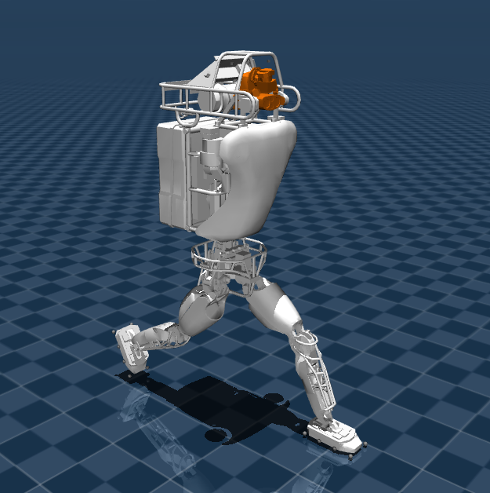
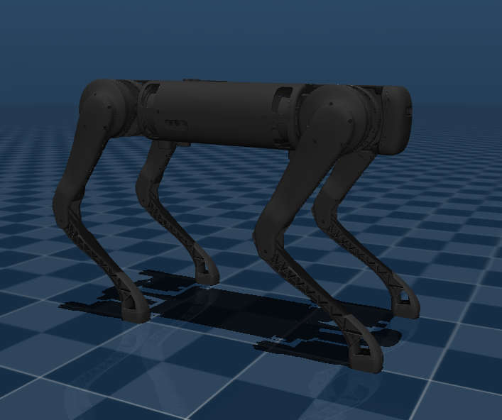

# Mujoco sagital legged robots

This repository contains MuJoCo and URDF models fixed in sagital plane for study of algorithms on legged robots.

## Atlas from Boston Dynamics

## B1 from Unitree Robotics

